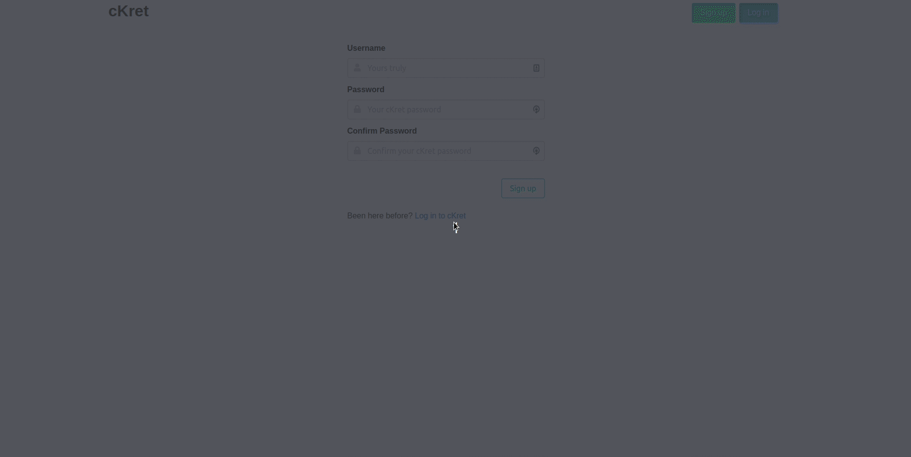

# cKret Frontend

A single-page application meant to serve as an authenticated Secret Manager Application, made with Angular 9 to demonstrate the usability of [ckret-backend](https://github.com/sharmarajdaksh/ckret-backend).

